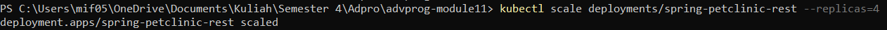
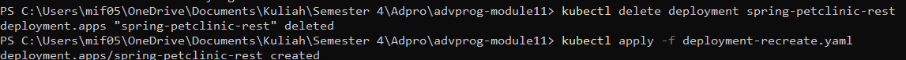

# Reflection Module 11

## Reflection on Hello Minikube
1. Compare the application logs before and after you exposed it as a Service. Try to open the app several times while the proxy into the Service is running. What do you see in the logs? Does the number of logs increase each time you open the app

    Before:
    

    After:
    

    Sebelum aplikasi dibuat sebagai service, log hanya menunjukkan informasi bahwa server telah dimulai pada port tertentu. Namun, setelah aplikasi diekspos sebagai service, log menunjukkan adanya aktivitas permintaan HTTP GET. Ini terlihat dari perbedaan isi log, di mana sebelum diekspos hanya mencatat informasi server, sementara setelah diekspos mencatat riwayat permintaan HTTP GET yang meningkat setiap kali halaman web aplikasi disegarkan.

2. Notice that there are two versions of `kubectl get` invocation during this tutorial section. The first does not have any option, while the latter has `-n` option with value set to
`kube-system`.

    Opsi -n pada perintah kubectl digunakan untuk menentukan namespace tertentu dalam cluster Kubernetes. Namespace berfungsi untuk memisahkan dan mengorganisir sumber daya dalam kluster. Jika menggunakan opsi -n kube-system, perintah kubectl get hanya akan menampilkan objek yang berada di dalam namespace kube-system. Tanpa opsi -n, kubectl secara default akan mencari objek dalam namespace default. Oleh karena itu, jika output tidak menampilkan pods atau services, kemungkinan besar sumber daya tersebut berada di namespace lain yang tidak ditentukan dalam perintah tersebut.

## Reflection on Rolling Update & Kubernetes Manifest File
1. What is the difference between Rolling Update and Recreate deployment strategy?
    
    Strategi Rolling Update di Kubernetes menggantikan pod lama dengan yang baru secara bertahap untuk menghindari downtime, sehingga beberapa instance aplikasi selalu aktif. Sedangkan strategi Recreate menghentikan semua pod lama sebelum memulai pod baru, menyebabkan downtime selama periode transisi. Rolling Update cocok untuk aplikasi yang membutuhkan ketersediaan tinggi, sementara Recreate lebih cocok untuk perubahan besar yang tidak memungkinkan kedua versi berjalan bersamaan
2. Try deploying the Spring Petclinic REST using Recreate deployment strategy and document
your attempt.

    - 

    - 

    - 

    - 
 
    - 

    - 

        Dalam screenshot sebelumnya, saya mencoba membuat deployment dan kemudian menghapusnya untuk mendemonstrasikan metode Recreate. Setelah penghapusan, terlihat bahwa pod baru dibuat. Selain itu, saya juga mencoba menjalankan dan memeriksa deployment melalui layanan sesuai instruksi dalam tutorial.

3. Prepare different manifest files for executing Recreate deployment strategy
    
    - Mengubah strategy jadi recreate

        
        
    - 

    - 

    - 

    File manifest yang baru adalah deployment-recreate.yaml. Yang berbeda hanya strategy: recreate

4. What do you think are the benefits of using Kubernetes manifest files? Recall your experience
in deploying the app manually and compare it to your experience when deploying the same app
by applying the manifest files (i.e., invoking `kubectl apply -f` command) to the cluster.

    Penggunaan file manifest Kubernetes sangat bermanfaat dan efisien dalam proses deployment. Dengan file manifest, kita dapat menghindari repetisi dan human error karena seluruh konfigurasi deployment, layanan, dan lainnya sudah terdefinisi dengan jelas dalam file YAML. Kita hanya perlu menjalankan satu perintah untuk menerapkan semua konfigurasi tersebut, tanpa harus mengingat kembali prosedur dan syntax yang kompleks. Hal ini mirip dengan proses mengimpor dokumen, di mana kita langsung mendapatkan dokumen siap pakai tanpa perlu memahami detail pembuatannya, sehingga memastikan layanan yang dibuat konsisten dan sesuai dengan spesifikasi dalam file manifest.
